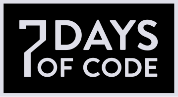

<h1 align="center">Desafío Alura Latam - 7DaysOfCode</h1>

---

<h2>Descripción:</h2>

**7DaysOfCode** es un desafío propuesto por Alura Latam para mejorar la Lógica en Programación con JavaScript.

---

<h2 id="tecnologias">Tecnologías:</h2>

* JavaScript 

* HTML 

* Visual Studio Code 

---

<h2 id="ejercicios">Ejercicios:</h2>

* **1 Día:** Operaciones Booleanas
* **2 Día:** Variables
* **3 Día:** 
* **4 Día:** 
* **5 Día:** 
* **6 Día:** 
* **7 Día:** 